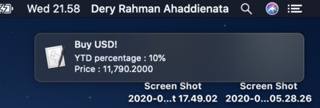
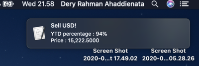

# USDIDR Notifier

USD to IDR notifier for MacOS. Specification:
- Price is taken from bloomberg
- Service will be run once you're connected
- Pop up sell will be appeared when YTD price is 80% or above
- Pop up buy will be appeared when YTD price is 20% or below

## Screenshot



## Requirements
- Mac OS X 10.4 or above

## Installation

```bash
git clone https://github.com/deryrahman/usdidr_notifier
cd usdidr_notifier
make install
```

## Run Instruction

To start the service
```bash
make start
```

To stop the service
```bash
make stop
```

## Uninstall

```bash
make uninstall
```
